# [📈 Live Status](https://demo.upptime.js.org): <!--live status--> **🟧 Partial outage**

This repository contains the open-source uptime monitor and status page for [Alliance Business Technologies](https://alliancecomp.com), powered by [Upptime](https://github.com/upptime/upptime).

With [Upptime](https://upptime.js.org), you can get your own unlimited and free uptime monitor and status page, powered entirely by a GitHub repository. We use [Issues](https://github.com/upptime/upptime/issues) as incident reports, [Actions](https://github.com/alliancewebteam/Website-Monitoring/actions) as uptime monitors, and [Pages](https://demo.upptime.js.org) for the status page.

<!--start: status pages-->
<!-- This summary is generated by Upptime (https://github.com/upptime/upptime) -->
<!-- Do not edit this manually, your changes will be overwritten -->
<!-- prettier-ignore -->
| URL | Status | History | Response Time | Uptime |
| --- | ------ | ------- | ------------- | ------ |
|  [Alliance Computers](https://alliancecomp.com) | 🟩 Up | [alliance-computers.yml](https://github.com/alliancewebteam/Website-Monitoring/commits/HEAD/history/alliance-computers.yml) | 

 363ms
     
 | 

<a href="https://alliancewebteam.github.io/Website-Monitoring/history/alliance-computers">100.00%</a>
    

|  [Access Bus & Van](https://www.accessbusandvan.com) | 🟩 Up | [access-bus-and-van.yml](https://github.com/alliancewebteam/Website-Monitoring/commits/HEAD/history/access-bus-and-van.yml) | 

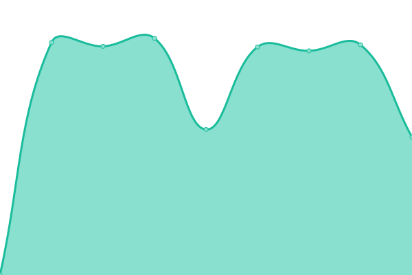 2198ms
     
 | 

<a href="https://alliancewebteam.github.io/Website-Monitoring/history/access-bus-and-van">100.00%</a>
    

|  [Allison Ong Shreffler, Architecture](https://harrisburgarchitects.net) | 🟩 Up | [allison-ong-shreffler-architecture.yml](https://github.com/alliancewebteam/Website-Monitoring/commits/HEAD/history/allison-ong-shreffler-architecture.yml) | 

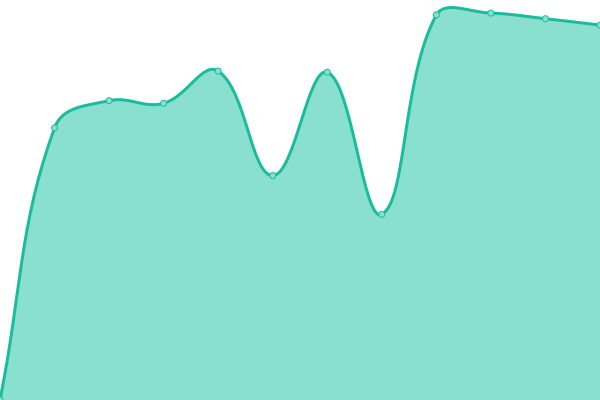 1449ms
     
 | 

<a href="https://alliancewebteam.github.io/Website-Monitoring/history/allison-ong-shreffler-architecture">100.00%</a>
    

|  [Allied Group PA](https://alliedgrouppa.com/) | 🟩 Up | [allied-group-pa.yml](https://github.com/alliancewebteam/Website-Monitoring/commits/HEAD/history/allied-group-pa.yml) | 

 246ms
     
 | 

<a href="https://alliancewebteam.github.io/Website-Monitoring/history/allied-group-pa">100.00%</a>
    

|  [Allied Maintenance Systems](https://www.alliedmaintenancesystems.com/) | 🟩 Up | [allied-maintenance-systems.yml](https://github.com/alliancewebteam/Website-Monitoring/commits/HEAD/history/allied-maintenance-systems.yml) | 

 425ms
     
 | 

<a href="https://alliancewebteam.github.io/Website-Monitoring/history/allied-maintenance-systems">100.00%</a>
    

|  [AquaTek Cleaning Solutions](https://aquatekpa.com/) | 🟩 Up | [aqua-tek-cleaning-solutions.yml](https://github.com/alliancewebteam/Website-Monitoring/commits/HEAD/history/aqua-tek-cleaning-solutions.yml) | 

 206ms
     
 | 

<a href="https://alliancewebteam.github.io/Website-Monitoring/history/aqua-tek-cleaning-solutions">100.00%</a>
    

|  [Anderson Pro Painting](https://andersonpropainting.com) | 🟩 Up | [anderson-pro-painting.yml](https://github.com/alliancewebteam/Website-Monitoring/commits/HEAD/history/anderson-pro-painting.yml) | 

 1629ms
     
 | 

<a href="https://alliancewebteam.github.io/Website-Monitoring/history/anderson-pro-painting">100.00%</a>
    

|  [Autism York](https://autismyork.org) | 🟩 Up | [autism-york.yml](https://github.com/alliancewebteam/Website-Monitoring/commits/HEAD/history/autism-york.yml) | 

 2330ms
     
 | 

<a href="https://alliancewebteam.github.io/Website-Monitoring/history/autism-york">100.00%</a>
    

|  [Bow Creek Financial And Jewelry](http://www.bowcreekfinancial.com) | 🟩 Up | [bow-creek-financial-and-jewelry.yml](https://github.com/alliancewebteam/Website-Monitoring/commits/HEAD/history/bow-creek-financial-and-jewelry.yml) | 

 309ms
     
 | 

<a href="https://alliancewebteam.github.io/Website-Monitoring/history/bow-creek-financial-and-jewelry">100.00%</a>
    

|  [Boyo Transportation](https://www.boyotrans.com) | 🟩 Up | [boyo-transportation.yml](https://github.com/alliancewebteam/Website-Monitoring/commits/HEAD/history/boyo-transportation.yml) | 

 480ms
     
 | 

<a href="https://alliancewebteam.github.io/Website-Monitoring/history/boyo-transportation">100.00%</a>
    

|  [Capital Hospitality Services](https://chshotelrenovations.com) | 🟩 Up | [capital-hospitality-services.yml](https://github.com/alliancewebteam/Website-Monitoring/commits/HEAD/history/capital-hospitality-services.yml) | 

 469ms
     
 | 

<a href="https://alliancewebteam.github.io/Website-Monitoring/history/capital-hospitality-services">100.00%</a>
    

|  [Carpet Care Solutions, Inc](https://harrisburgarchitects.net) | 🟩 Up | [carpet-care-solutions-inc.yml](https://github.com/alliancewebteam/Website-Monitoring/commits/HEAD/history/carpet-care-solutions-inc.yml) | 

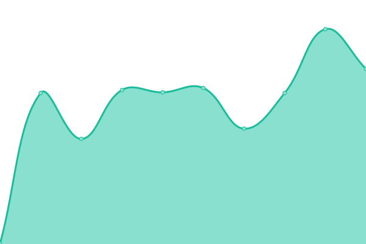 1139ms
     
 | 

<a href="https://alliancewebteam.github.io/Website-Monitoring/history/carpet-care-solutions-inc">100.00%</a>
    

|  [Center For Independent Living](https://cilopportunities.org/) | 🟩 Up | [center-for-independent-living.yml](https://github.com/alliancewebteam/Website-Monitoring/commits/HEAD/history/center-for-independent-living.yml) | 

 650ms
     
 | 

<a href="https://alliancewebteam.github.io/Website-Monitoring/history/center-for-independent-living">100.00%</a>
    

|  [Christ Presbyterian Church](https://www.christchurchcamphill.org/) | 🟩 Up | [christ-presbyterian-church.yml](https://github.com/alliancewebteam/Website-Monitoring/commits/HEAD/history/christ-presbyterian-church.yml) | 

 2989ms
     
 | 

<a href="https://alliancewebteam.github.io/Website-Monitoring/history/christ-presbyterian-church">100.00%</a>
    

|  [Christopher Columbus Scholarship Foundation](https://www.ccsfyorkpa.org/) | 🟩 Up | [christopher-columbus-scholarship-foundation.yml](https://github.com/alliancewebteam/Website-Monitoring/commits/HEAD/history/christopher-columbus-scholarship-foundation.yml) | 

 536ms
     
 | 

<a href="https://alliancewebteam.github.io/Website-Monitoring/history/christopher-columbus-scholarship-foundation">100.00%</a>
    

|  [Clarke Benefits](https://clarkebenefits4u.com/) | 🟩 Up | [clarke-benefits.yml](https://github.com/alliancewebteam/Website-Monitoring/commits/HEAD/history/clarke-benefits.yml) | 

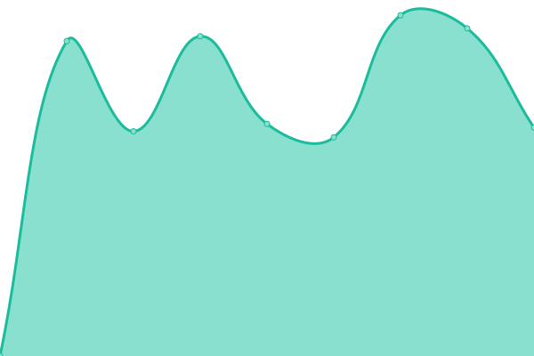 2854ms
     
 | 

<a href="https://alliancewebteam.github.io/Website-Monitoring/history/clarke-benefits">100.00%</a>
    

|  [Creative Building Concepts](https://buildsomethingcreative.com/) | 🟩 Up | [creative-building-concepts.yml](https://github.com/alliancewebteam/Website-Monitoring/commits/HEAD/history/creative-building-concepts.yml) | 

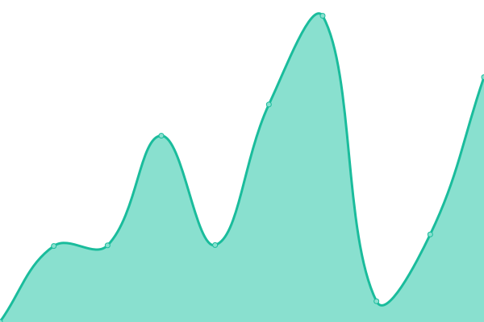 1760ms
     
 | 

<a href="https://alliancewebteam.github.io/Website-Monitoring/history/creative-building-concepts">100.00%</a>
    

|  [Creative Law Studio](https://www.creativelawstudio.com/) | 🟩 Up | [creative-law-studio.yml](https://github.com/alliancewebteam/Website-Monitoring/commits/HEAD/history/creative-law-studio.yml) | 

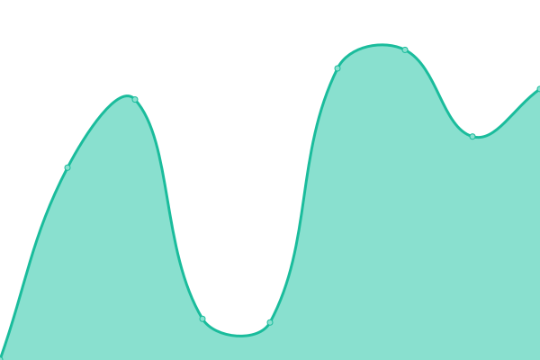 361ms
     
 | 

<a href="https://alliancewebteam.github.io/Website-Monitoring/history/creative-law-studio">100.00%</a>
    

|  [Dale Wagner Insurance Agency](https://www.dwi-ins.com/) | 🟩 Up | [dale-wagner-insurance-agency.yml](https://github.com/alliancewebteam/Website-Monitoring/commits/HEAD/history/dale-wagner-insurance-agency.yml) | 

 2539ms
     
 | 

<a href="https://alliancewebteam.github.io/Website-Monitoring/history/dale-wagner-insurance-agency">100.00%</a>
    

|  [DB360 Soft Wash](https://db360wash.com) | 🟩 Up | [db-360-soft-wash.yml](https://github.com/alliancewebteam/Website-Monitoring/commits/HEAD/history/db-360-soft-wash.yml) | 

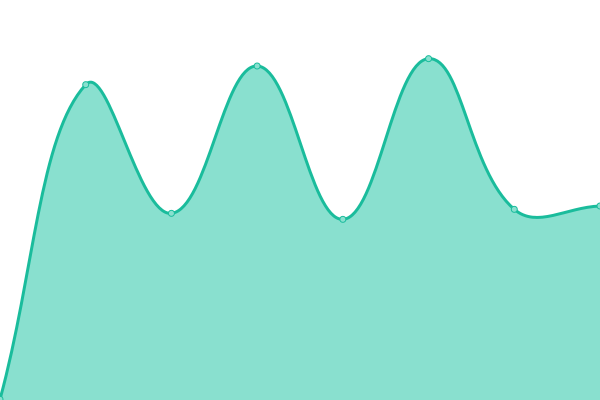 413ms
     
 | 

<a href="https://alliancewebteam.github.io/Website-Monitoring/history/db-360-soft-wash">100.00%</a>
    

|  [Down East Granite](https://www.downeastfab.com/) | 🟩 Up | [down-east-granite.yml](https://github.com/alliancewebteam/Website-Monitoring/commits/HEAD/history/down-east-granite.yml) | 

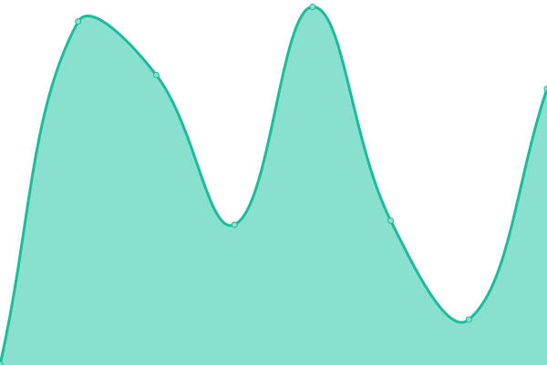 551ms
     
 | 

<a href="https://alliancewebteam.github.io/Website-Monitoring/history/down-east-granite">100.00%</a>
    

|  [Dream Home Realty](https://dreamhrpa.com) | 🟩 Up | [dream-home-realty.yml](https://github.com/alliancewebteam/Website-Monitoring/commits/HEAD/history/dream-home-realty.yml) | 

 444ms
     
 | 

<a href="https://alliancewebteam.github.io/Website-Monitoring/history/dream-home-realty">100.00%</a>
    

|  [Duffy's Bed And Biscuit](https://duffysbedandbiscuit.com) | 🟩 Up | [duffy-s-bed-and-biscuit.yml](https://github.com/alliancewebteam/Website-Monitoring/commits/HEAD/history/duffy-s-bed-and-biscuit.yml) | 

 457ms
     
 | 

<a href="https://alliancewebteam.github.io/Website-Monitoring/history/duffy-s-bed-and-biscuit">100.00%</a>
    

|  [F&M Designs](https://fandmdesigns.com) | 🟩 Up | [f-and-m-designs.yml](https://github.com/alliancewebteam/Website-Monitoring/commits/HEAD/history/f-and-m-designs.yml) | 

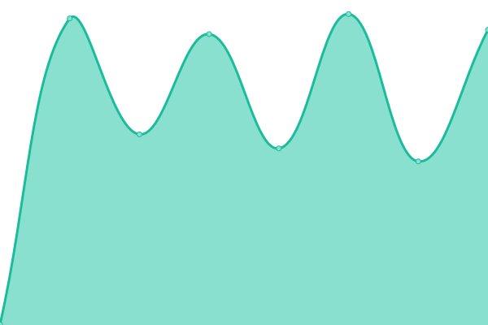 440ms
     
 | 

<a href="https://alliancewebteam.github.io/Website-Monitoring/history/f-and-m-designs">100.00%</a>
    

|  [Fortney Printing](https://www.fortneyprinting.com/) | 🟩 Up | [fortney-printing.yml](https://github.com/alliancewebteam/Website-Monitoring/commits/HEAD/history/fortney-printing.yml) | 

 397ms
     
 | 

<a href="https://alliancewebteam.github.io/Website-Monitoring/history/fortney-printing">100.00%</a>
    

|  [Glossner & Mcelwee Family Dentistry](https://gmdentalcare.net/) | 🟩 Up | [glossner-and-mcelwee-family-dentistry.yml](https://github.com/alliancewebteam/Website-Monitoring/commits/HEAD/history/glossner-and-mcelwee-family-dentistry.yml) | 

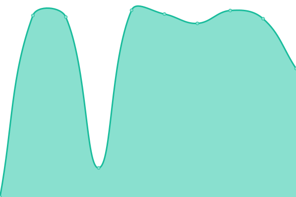 2006ms
     
 | 

<a href="https://alliancewebteam.github.io/Website-Monitoring/history/glossner-and-mcelwee-family-dentistry">100.00%</a>
    

|  [Go Life Surfing Inc.](https://golifesurfing.com/) | 🟩 Up | [go-life-surfing-inc.yml](https://github.com/alliancewebteam/Website-Monitoring/commits/HEAD/history/go-life-surfing-inc.yml) | 

 2724ms
     
 | 

<a href="https://alliancewebteam.github.io/Website-Monitoring/history/go-life-surfing-inc">100.00%</a>
    

|  [Grassworks Landscaping](https://grassworkslandscaping.com/) | 🟩 Up | [grassworks-landscaping.yml](https://github.com/alliancewebteam/Website-Monitoring/commits/HEAD/history/grassworks-landscaping.yml) | 

 624ms
     
 | 

<a href="https://alliancewebteam.github.io/Website-Monitoring/history/grassworks-landscaping">100.00%</a>
    

|  [Guth Laboratories](https://www.guthlabs.com/) | 🟩 Up | [guth-laboratories.yml](https://github.com/alliancewebteam/Website-Monitoring/commits/HEAD/history/guth-laboratories.yml) | 

 2549ms
     
 | 

<a href="https://alliancewebteam.github.io/Website-Monitoring/history/guth-laboratories">100.00%</a>
    

|  [Habitat for Humanity of the Greater Harrisburg Area](https://harrisburghabitat.org/) | 🟩 Up | [habitat-for-humanity-of-the-greater-harrisburg-area.yml](https://github.com/alliancewebteam/Website-Monitoring/commits/HEAD/history/habitat-for-humanity-of-the-greater-harrisburg-area.yml) | 

 2322ms
     
 | 

<a href="https://alliancewebteam.github.io/Website-Monitoring/history/habitat-for-humanity-of-the-greater-harrisburg-area">100.00%</a>
    

|  [Habitat for Humanity of the Greater Harrisburg Area - ReStore](https://harrisburgrestore.org/) | 🟩 Up | [habitat-for-humanity-of-the-greater-harrisburg-area-re-store.yml](https://github.com/alliancewebteam/Website-Monitoring/commits/HEAD/history/habitat-for-humanity-of-the-greater-harrisburg-area-re-store.yml) | 

 1876ms
     
 | 

<a href="https://alliancewebteam.github.io/Website-Monitoring/history/habitat-for-humanity-of-the-greater-harrisburg-area-re-store">100.00%</a>
    

|  [Handyworx](https://www.thehandyworx.com/) | 🟩 Up | [handyworx.yml](https://github.com/alliancewebteam/Website-Monitoring/commits/HEAD/history/handyworx.yml) | 

 512ms
     
 | 

<a href="https://alliancewebteam.github.io/Website-Monitoring/history/handyworx">100.00%</a>
    

|  [Hershey Real Estate Group](https://hersheyreg.com/) | 🟩 Up | [hershey-real-estate-group.yml](https://github.com/alliancewebteam/Website-Monitoring/commits/HEAD/history/hershey-real-estate-group.yml) | 

 405ms
     
 | 

<a href="https://alliancewebteam.github.io/Website-Monitoring/history/hershey-real-estate-group">100.00%</a>
    

|  [Hoem Inc.](https://www.hoem-inc.com/) | 🟥 Down | [hoem-inc.yml](https://github.com/alliancewebteam/Website-Monitoring/commits/HEAD/history/hoem-inc.yml) | 

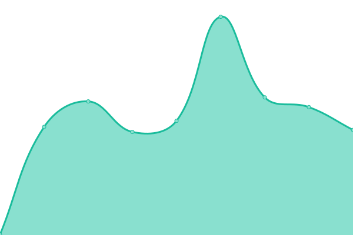 0ms
     
 | 

<a href="https://alliancewebteam.github.io/Website-Monitoring/history/hoem-inc">0.00%</a>
    

|  [Hoem Inc. / Precision Metal Fabricating](https:/precisionmetalpa.com/) | 🟩 Up | [hoem-inc-precision-metal-fabricating.yml](https://github.com/alliancewebteam/Website-Monitoring/commits/HEAD/history/hoem-inc-precision-metal-fabricating.yml) | 

 518ms
     
 | 

<a href="https://alliancewebteam.github.io/Website-Monitoring/history/hoem-inc-precision-metal-fabricating">100.00%</a>
    

|  [Home Builders Association of Metropolitan Harrisburg](https://www.harrisburgbuilders.com/) | 🟩 Up | [home-builders-association-of-metropolitan-harrisburg.yml](https://github.com/alliancewebteam/Website-Monitoring/commits/HEAD/history/home-builders-association-of-metropolitan-harrisburg.yml) | 

 1941ms
     
 | 

<a href="https://alliancewebteam.github.io/Website-Monitoring/history/home-builders-association-of-metropolitan-harrisburg">100.00%</a>
    

|  [HBA / PA Home & Garden Design Expo](https://www.pahomeandgarden.com/) | 🟩 Up | [hba-pa-home-and-garden-design-expo.yml](https://github.com/alliancewebteam/Website-Monitoring/commits/HEAD/history/hba-pa-home-and-garden-design-expo.yml) | 

 1232ms
     
 | 

<a href="https://alliancewebteam.github.io/Website-Monitoring/history/hba-pa-home-and-garden-design-expo">100.00%</a>
    

|  [HMR Auto Body](https://hmrautobody.com/) | 🟩 Up | [hmr-auto-body.yml](https://github.com/alliancewebteam/Website-Monitoring/commits/HEAD/history/hmr-auto-body.yml) | 

 403ms
     
 | 

<a href="https://alliancewebteam.github.io/Website-Monitoring/history/hmr-auto-body">100.00%</a>
    

|  [Impact Harrisburg](https://impactharrisburg.org/) | 🟩 Up | [impact-harrisburg.yml](https://github.com/alliancewebteam/Website-Monitoring/commits/HEAD/history/impact-harrisburg.yml) | 

 427ms
     
 | 

<a href="https://alliancewebteam.github.io/Website-Monitoring/history/impact-harrisburg">100.00%</a>
    

|  [Indian Creek](https://indiancreekcommunity.org/) | 🟩 Up | [indian-creek.yml](https://github.com/alliancewebteam/Website-Monitoring/commits/HEAD/history/indian-creek.yml) | 

 11912ms
     
 | 

<a href="https://alliancewebteam.github.io/Website-Monitoring/history/indian-creek">98.62%</a>
    

|  [John Jewett](https://jhowardcahill.com/) | 🟩 Up | [john-jewett.yml](https://github.com/alliancewebteam/Website-Monitoring/commits/HEAD/history/john-jewett.yml) | 

 4047ms
     
 | 

<a href="https://alliancewebteam.github.io/Website-Monitoring/history/john-jewett">100.00%</a>
    

|  [Key Painting](https://keypainting.net/) | 🟩 Up | [key-painting.yml](https://github.com/alliancewebteam/Website-Monitoring/commits/HEAD/history/key-painting.yml) | 

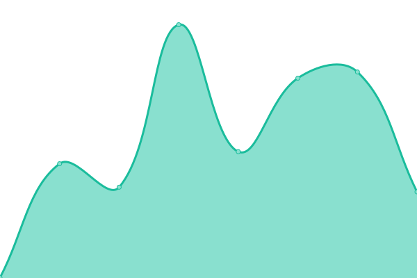 1721ms
     
 | 

<a href="https://alliancewebteam.github.io/Website-Monitoring/history/key-painting">100.00%</a>
    

|  [King's View Acres](https://www.kingsviewacres.com/) | 🟩 Up | [king-s-view-acres.yml](https://github.com/alliancewebteam/Website-Monitoring/commits/HEAD/history/king-s-view-acres.yml) | 

 433ms
     
 | 

<a href="https://alliancewebteam.github.io/Website-Monitoring/history/king-s-view-acres">100.00%</a>
    

|  [Machining America](https://machiningamerica.com/) | 🟩 Up | [machining-america.yml](https://github.com/alliancewebteam/Website-Monitoring/commits/HEAD/history/machining-america.yml) | 

 414ms
     
 | 

<a href="https://alliancewebteam.github.io/Website-Monitoring/history/machining-america">100.00%</a>
    

|  [MJR Equipment](https://www.mjrequipment.com/) | 🟩 Up | [mjr-equipment.yml](https://github.com/alliancewebteam/Website-Monitoring/commits/HEAD/history/mjr-equipment.yml) | 

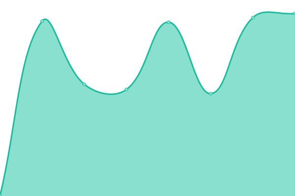 652ms
     
 | 

<a href="https://alliancewebteam.github.io/Website-Monitoring/history/mjr-equipment">100.00%</a>
    

|  [Moyles Muzic Law](https://www.moyleslaw.com/) | 🟩 Up | [moyles-muzic-law.yml](https://github.com/alliancewebteam/Website-Monitoring/commits/HEAD/history/moyles-muzic-law.yml) | 

 787ms
     
 | 

<a href="https://alliancewebteam.github.io/Website-Monitoring/history/moyles-muzic-law">100.00%</a>
    

|  [Mr Sandman Flooring](https://callmrsandman.com/) | 🟩 Up | [mr-sandman-flooring.yml](https://github.com/alliancewebteam/Website-Monitoring/commits/HEAD/history/mr-sandman-flooring.yml) | 

 354ms
     
 | 

<a href="https://alliancewebteam.github.io/Website-Monitoring/history/mr-sandman-flooring">100.00%</a>
    

|  [Pigott Agency](https://www.pigottagencyllc.com/) | 🟩 Up | [pigott-agency.yml](https://github.com/alliancewebteam/Website-Monitoring/commits/HEAD/history/pigott-agency.yml) | 

 441ms
     
 | 

<a href="https://alliancewebteam.github.io/Website-Monitoring/history/pigott-agency">100.00%</a>
    

|  [PrimeFyre LLC](https://primefyre.com/) | 🟩 Up | [prime-fyre-llc.yml](https://github.com/alliancewebteam/Website-Monitoring/commits/HEAD/history/prime-fyre-llc.yml) | 

 3123ms
     
 | 

<a href="https://alliancewebteam.github.io/Website-Monitoring/history/prime-fyre-llc">100.00%</a>
    

|  [Reach For More](https://reachformore.fit/) | 🟩 Up | [reach-for-more.yml](https://github.com/alliancewebteam/Website-Monitoring/commits/HEAD/history/reach-for-more.yml) | 

 528ms
     
 | 

<a href="https://alliancewebteam.github.io/Website-Monitoring/history/reach-for-more">100.00%</a>
    

|  [Reves Etheres Event LLC](https://revesetheres.com/) | 🟩 Up | [reves-etheres-event-llc.yml](https://github.com/alliancewebteam/Website-Monitoring/commits/HEAD/history/reves-etheres-event-llc.yml) | 

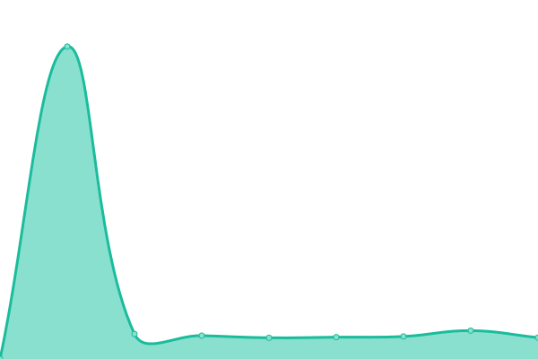 3095ms
     
 | 

<a href="https://alliancewebteam.github.io/Website-Monitoring/history/reves-etheres-event-llc">100.00%</a>
    

|  [Redd's Smokehouse BBQ](https://reddssmokehousebbq.com/) | 🟩 Up | [redd-s-smokehouse-bbq.yml](https://github.com/alliancewebteam/Website-Monitoring/commits/HEAD/history/redd-s-smokehouse-bbq.yml) | 

 2250ms
     
 | 

<a href="https://alliancewebteam.github.io/Website-Monitoring/history/redd-s-smokehouse-bbq">100.00%</a>
    

|  [Saidis, Shultz, & Fisher](https://www.ssfadvocates.com/) | 🟩 Up | [saidis-shultz-and-fisher.yml](https://github.com/alliancewebteam/Website-Monitoring/commits/HEAD/history/saidis-shultz-and-fisher.yml) | 

 490ms
     
 | 

<a href="https://alliancewebteam.github.io/Website-Monitoring/history/saidis-shultz-and-fisher">100.00%</a>
    

|  [Savannah's](https://sohclub.com) | 🟩 Up | [savannah-s.yml](https://github.com/alliancewebteam/Website-Monitoring/commits/HEAD/history/savannah-s.yml) | 

 632ms
     
 | 

<a href="https://alliancewebteam.github.io/Website-Monitoring/history/savannah-s">100.00%</a>
    

|  [Securewire Technologies LLC](https://www.securewiretech.com/) | 🟩 Up | [securewire-technologies-llc.yml](https://github.com/alliancewebteam/Website-Monitoring/commits/HEAD/history/securewire-technologies-llc.yml) | 

 1535ms
     
 | 

<a href="https://alliancewebteam.github.io/Website-Monitoring/history/securewire-technologies-llc">100.00%</a>
    

|  [Seifert Woodcrafts](https://seifertwc.com/) | 🟩 Up | [seifert-woodcrafts.yml](https://github.com/alliancewebteam/Website-Monitoring/commits/HEAD/history/seifert-woodcrafts.yml) | 

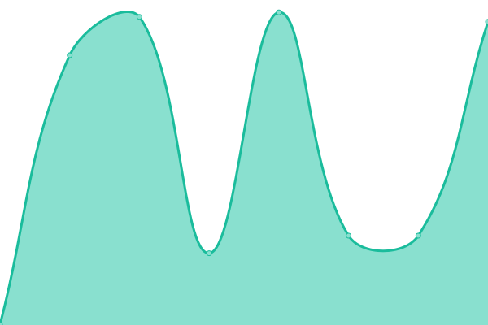 496ms
     
 | 

<a href="https://alliancewebteam.github.io/Website-Monitoring/history/seifert-woodcrafts">100.00%</a>
    

|  [Simply Greek, Hershey](https://simplygreekhershey.com) | 🟩 Up | [simply-greek-hershey.yml](https://github.com/alliancewebteam/Website-Monitoring/commits/HEAD/history/simply-greek-hershey.yml) | 

 2728ms
     
 | 

<a href="https://alliancewebteam.github.io/Website-Monitoring/history/simply-greek-hershey">100.00%</a>
    

|  [Steve Puchalo / Church of God](https://www.followjesuscog.com/) | 🟩 Up | [steve-puchalo-church-of-god.yml](https://github.com/alliancewebteam/Website-Monitoring/commits/HEAD/history/steve-puchalo-church-of-god.yml) | 

 630ms
     
 | 

<a href="https://alliancewebteam.github.io/Website-Monitoring/history/steve-puchalo-church-of-god">100.00%</a>
    

|  [Stone and Edwards](https://www.stoneandedwards.com/) | 🟩 Up | [stone-and-edwards.yml](https://github.com/alliancewebteam/Website-Monitoring/commits/HEAD/history/stone-and-edwards.yml) | 

 1725ms
     
 | 

<a href="https://alliancewebteam.github.io/Website-Monitoring/history/stone-and-edwards">100.00%</a>
    

|  [Strategic Response Firearms Training](https://www.srft16.com/) | 🟩 Up | [strategic-response-firearms-training.yml](https://github.com/alliancewebteam/Website-Monitoring/commits/HEAD/history/strategic-response-firearms-training.yml) | 

 458ms
     
 | 

<a href="https://alliancewebteam.github.io/Website-Monitoring/history/strategic-response-firearms-training">100.00%</a>
    

|  [Sunrise Stables](https://sunrisehorseboarding.com/) | 🟩 Up | [sunrise-stables.yml](https://github.com/alliancewebteam/Website-Monitoring/commits/HEAD/history/sunrise-stables.yml) | 

 323ms
     
 | 

<a href="https://alliancewebteam.github.io/Website-Monitoring/history/sunrise-stables">100.00%</a>
    

|  [Szeles and Associates](https://www.szelesas.com/) | 🟩 Up | [szeles-and-associates.yml](https://github.com/alliancewebteam/Website-Monitoring/commits/HEAD/history/szeles-and-associates.yml) | 

 1780ms
     
 | 

<a href="https://alliancewebteam.github.io/Website-Monitoring/history/szeles-and-associates">100.00%</a>
    

|  [The Meadows Pet Resort](https://www.themeadowspetresort.com/) | 🟩 Up | [the-meadows-pet-resort.yml](https://github.com/alliancewebteam/Website-Monitoring/commits/HEAD/history/the-meadows-pet-resort.yml) | 

 507ms
     
 | 

<a href="https://alliancewebteam.github.io/Website-Monitoring/history/the-meadows-pet-resort">100.00%</a>
    

|  [Touch of Color Flooring](https://touchofcolorflooring.com/) | 🟩 Up | [touch-of-color-flooring.yml](https://github.com/alliancewebteam/Website-Monitoring/commits/HEAD/history/touch-of-color-flooring.yml) | 

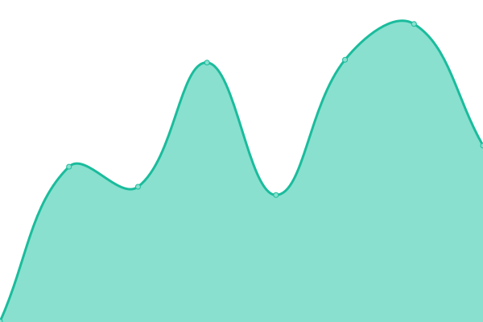 1165ms
     
 | 

<a href="https://alliancewebteam.github.io/Website-Monitoring/history/touch-of-color-flooring">99.77%</a>
    

|  [Tritan Pool and Spa](https://www.tritanpoolandspa.com/) | 🟩 Up | [tritan-pool-and-spa.yml](https://github.com/alliancewebteam/Website-Monitoring/commits/HEAD/history/tritan-pool-and-spa.yml) | 

 1846ms
     
 | 

<a href="https://alliancewebteam.github.io/Website-Monitoring/history/tritan-pool-and-spa">100.00%</a>
    

|  [Trix of the Trade Salon](https://trixofthetradesalon.com/) | 🟩 Up | [trix-of-the-trade-salon.yml](https://github.com/alliancewebteam/Website-Monitoring/commits/HEAD/history/trix-of-the-trade-salon.yml) | 

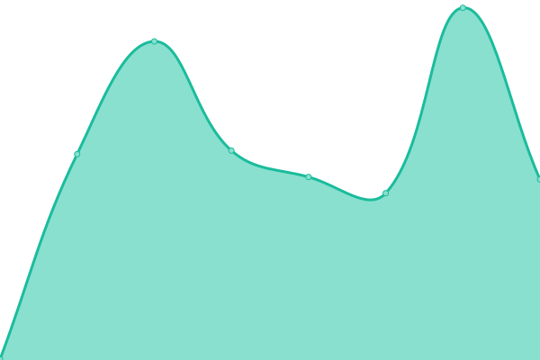 432ms
     
 | 

<a href="https://alliancewebteam.github.io/Website-Monitoring/history/trix-of-the-trade-salon">100.00%</a>
    

|  [Upon This Rock Ministries](https://uponthisrock2950.com/) | 🟩 Up | [upon-this-rock-ministries.yml](https://github.com/alliancewebteam/Website-Monitoring/commits/HEAD/history/upon-this-rock-ministries.yml) | 

 409ms
     
 | 

<a href="https://alliancewebteam.github.io/Website-Monitoring/history/upon-this-rock-ministries">100.00%</a>
    

|  [West Shore Elks](https://westshoreelks.org/) | 🟩 Up | [west-shore-elks.yml](https://github.com/alliancewebteam/Website-Monitoring/commits/HEAD/history/west-shore-elks.yml) | 

 1846ms
     
 | 

<a href="https://alliancewebteam.github.io/Website-Monitoring/history/west-shore-elks">100.00%</a>
    

|  [Wide Horizons Travel](https://widehorizonstravel.com/) | 🟩 Up | [wide-horizons-travel.yml](https://github.com/alliancewebteam/Website-Monitoring/commits/HEAD/history/wide-horizons-travel.yml) | 

 471ms
     
 | 

<a href="https://alliancewebteam.github.io/Website-Monitoring/history/wide-horizons-travel">100.00%</a>
    

|  [Woodburn Law](https://www.woodburn-law.com/) | 🟩 Up | [woodburn-law.yml](https://github.com/alliancewebteam/Website-Monitoring/commits/HEAD/history/woodburn-law.yml) | 

 586ms
     
 | 

<a href="https://alliancewebteam.github.io/Website-Monitoring/history/woodburn-law">100.00%</a>
    

|  [Zang Physical Therapy](https://zangpt.com/) | 🟩 Up | [zang-physical-therapy.yml](https://github.com/alliancewebteam/Website-Monitoring/commits/HEAD/history/zang-physical-therapy.yml) | 

 2375ms
     
 | 

<a href="https://alliancewebteam.github.io/Website-Monitoring/history/zang-physical-therapy">99.59%</a>
    

<!--end: status pages-->

[**Visit our status website →**](https://alliancewebteam.github.io/Website-Monitoring/)

## 📄 License

- Powered by: [Upptime](https://github.com/upptime/upptime)
- Code: [MIT](./LICENSE) © [Upptime](https://upptime.js.org)
- Data in the `./history` directory: [Open Database License](https://opendatacommons.org/licenses/odbl/1-0/)
